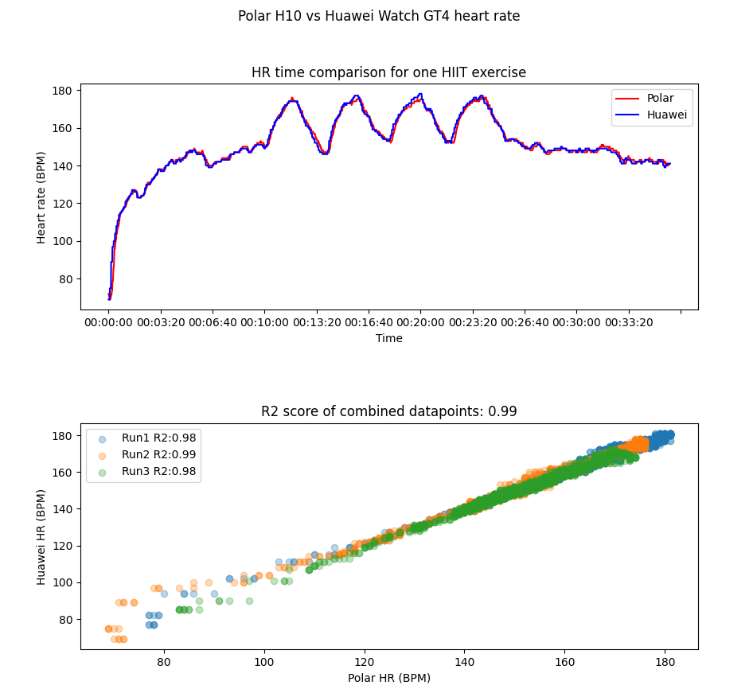

# Huawei-wearable-data-export-and-analysis
Huawei wearables data comparison with Polar gold standard (H10 strap). Full data extraction procedure explained

**The process for Huawei data:**
1. Recording the activity with Huawei wearable and Huawei Health as usual. When the activity is visible in Huawei health it can be synchronized with Health sync app.(highly recommending, a nice app. [Available here](https://play.google.com/store/apps/details?id=nl.appyhapps.healthsync&pcampaignid=web_share))
2. In the Health sync app I synchronized the "Activities" option from Huawei health to google drive. There is a free trial version of the app, but the one time fee for the unlimited use is reasonable.
3. The data of interest (second by second HR info of the exercise) is found from the .fit file. Tried to use the "Heart rate" export function, but it seems to contain HR info of the whole day at much lower sample rate.
4. Load the fit file from the drive to the wanted location for analysis

**The process for Polar data:**
1. Record the activity with Polar wearable so that it is synchronized to Polar Flow service. Go to Polar flow Web UI and export activity as csv. This file contains the HR info and some other data.
2. Move the file to wanted location for analysis

The plot output:

